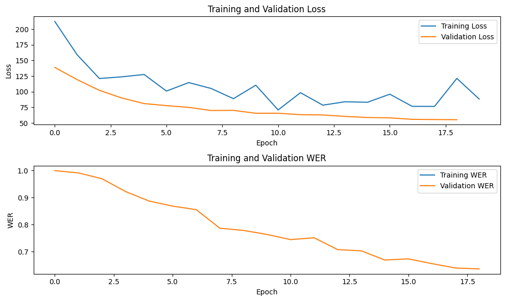
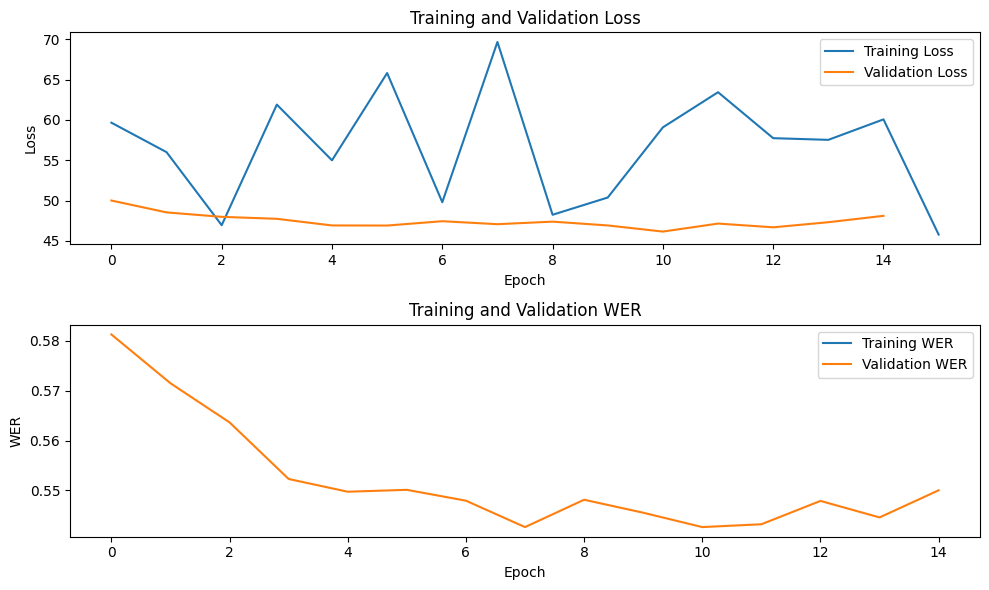
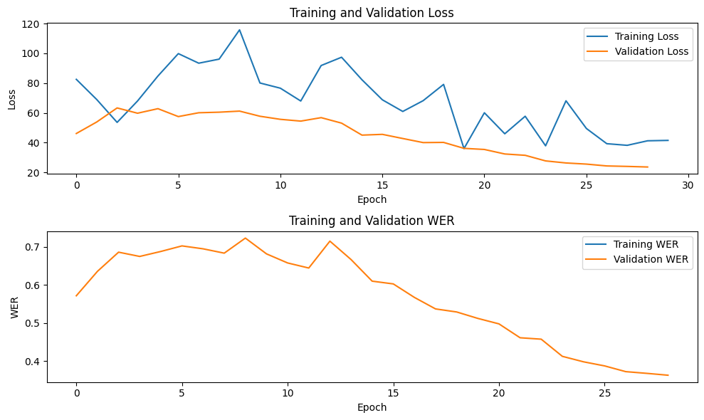
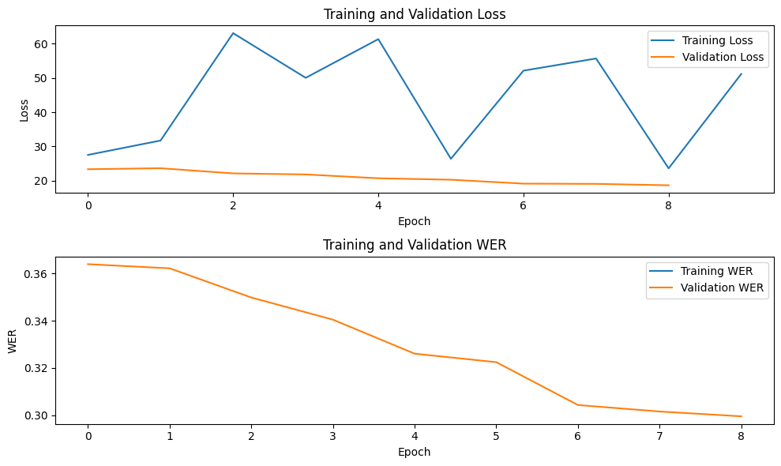
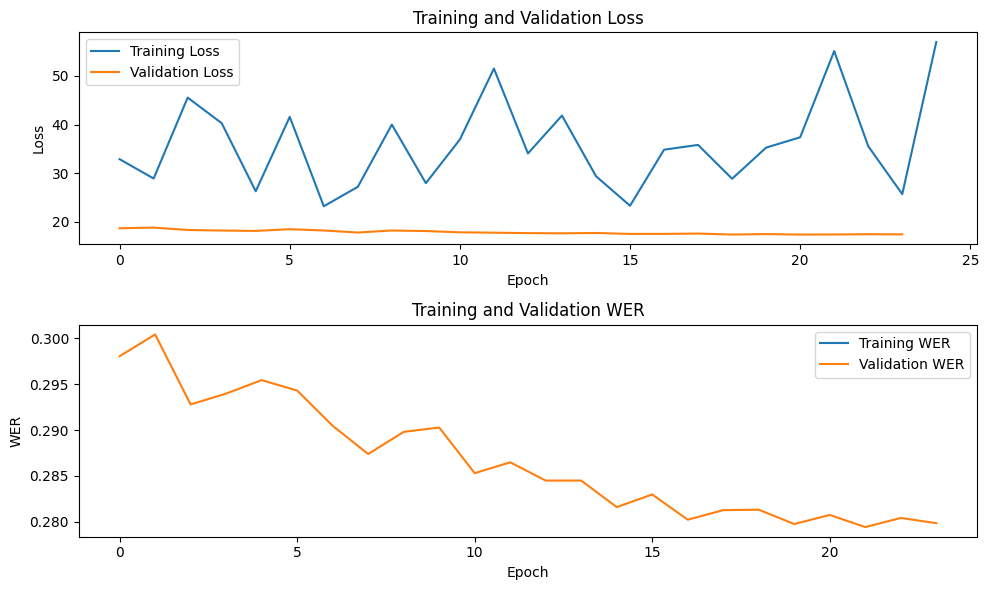
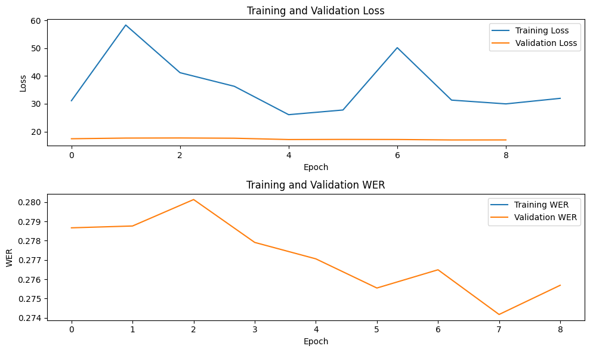

# Conformer-CTC-based ASR System for Egyptian-Arabic Speech Recognition


### ✨ Check out [inference.py](./inference.py) to use our best model checkpoint for inference. Have fun experimenting with our model! 🚀


## Table of Contents
1. [📘 Introduction](#introduction)
2. [🏆 Performance Improvement](#performance-improvement)
3. [🏗️ System Architecture](#system-architecture)
4. [🧠 Methodology](#methodology)
5. [🔧 Technical Details](#technical-details)
6. [📊 Results](#results)
7. [🔁 Reproducibility](#reproducibility)
8. [🚀 Performance Assessment](#performance-assessment)

   

## Introduction 📘

This project implements an Automatic Speech Recognition (ASR) system for Egyptian-Arabic dialect using the Conformer-CTC architecture. Conformer-CTC is an end-to-end neural acoustic model that achieves state-of-the-art accuracy by combining the strengths of Transformer and Convolution Neural Networks (CNNs).

The Conformer architecture, as described in the original paper: [Conformer: Convolution-augmented Transformer for Speech Recognition](https://arxiv.org/abs/2005.08100), integrates convolution neural networks into the Transformer model. It consists of a multi-headed self-attention module, a convolution module, and a feed-forward module. This design allows the model to capture both global context and local feature information effectively.
The Conformer-CTC model is trained using Connectionist Temporal Classification (CTC) loss, which enables it to align speech frames with text transcriptions without requiring explicit alignment information. This approach makes the model particularly well-suited for end-to-end speech recognition tasks.

## Performance Improvement 🏆

Our Conformer-CTC-based system significantly outperforms both our previous QuartzNet-based ASR system and the top models from the MTC-AIC2 competition:

1. Current Conformer-CTC model: 8.739281 WER
2. First place in MTC-AIC2 Phase 1: 10.785631 WER
3. Our previous QuartzNet model (3rd place): 11.732908 WER

These results demonstrate:
- A 18.97% relative improvement over the first place model in the MTC-AIC2 competition.
- A 25.51% relative improvement over our own QuartzNet-based system, which achieved 3rd place in the competition.

For reference:
- Our previous QuartzNet-based ASR system: [QuartzNet EGY Arabic Speech Recognition](https://github.com/AmrKhaledSaleh/QuartzNet-EGY-Arabic-Speech-Recognition)
- MTC-AIC2 competition leaderboard: [Kaggle MTC-AIC2 Leaderboard](https://www.kaggle.com/competitions/mct-aic-2/leaderboard)


## System Architecture 🏗️

Our implementation uses a medium-sized Conformer-CTC architecture, which consists of:
- An input preprocessing layer (AudioToMelSpectrogramPreprocessor)
- A Conformer encoder
- A decoder layer
- Connectionist Temporal Classification (CTC) loss

The Conformer encoder, which is the core of the model, contains:
- 18 Conformer layers
- 256 hidden dimensions (d_model)
- 4 attention heads
- Feed-forward expansion factor of 4
- Convolution kernel size of 31

Key components of each Conformer layer include:
- Multi-head self-attention module
- Convolution module
- Feed-forward module
- Layer normalization and residual connections

Additional features:
- Subsampling with a factor of 4 using striding
- Relative positional encoding
- Dropout rates of 0.1 for various components

The model uses spectrogram augmentation for data augmentation, with 2 frequency masks and 5 time masks.
This architecture balances performance and computational efficiency, resulting in approximately **31 million** parameters, suitable for Arabic ASR tasks while maintaining reasonable training and inference times.

## Methodology 🧠

1. **Data Preparation**: We used the Arabic speech dataset provided by the MTC-AIC2 organizers. The data is processed and converted into manifest files for training and validation.

2. **Model Configuration**: We used the NeMo toolkit to configure and train the Conformer-CTC model. The configuration includes:
   - Audio preprocessing parameters
   - Model architecture details
   - Training hyperparameters

3. **Training**: The model was trained using PyTorch Lightning with the following settings:
   - Mixed precision (16-bit)
   - GPU acceleration
   - Maximum of 110 epochs
   - Novograd optimizer with Cosine Annealing learning rate schedule

4. **Evaluation**: We evaluated the model's performance using Word Error Rate (WER) on the validation set provided by the MTC-AIC2 organizers.

## Technical Details 🔧

### Model Configuration

#### Preprocessor: AudioToMelSpectrogramPreprocessor
- Sample rate: 16000 Hz
- Window size: 0.025
- Window stride: 0.01
- Features: 80
- n_fft: 512
- Log spectrograms: True

#### Encoder: ConformerEncoder
- 18 Conformer layers
- d_model: 256
- 4 attention heads
- Subsampling factor: 4
- Convolution kernel size: 31
- Feed-forward expansion factor: 4

#### Decoder: ConvASRDecoder
- Input features: Determined by encoder output
- 41 output classes (Arabic characters and special tokens)

## Training Configuration

### Optimizer: Novograd
- Learning rate: 0.001
- Betas: [0.8, 0.5]
- Weight decay: 0.001

### Learning Rate Schedule: CosineAnnealing
- Warmup steps: 1000
- Minimum learning rate: 1e-9

### Data Augmentation: SpecAugment
- Frequency masks: 2
- Time masks: 5
- Frequency width: 27
- Time width: 0.05

### Other Training Details
- Batch Size: 
  - Training: 32
  - Validation: 16
- CTC Loss: Reduction method - mean_batch

## Results 📊

**We trained the model for various numbers of epochs (20, 40, 60, 80, 100, 120) and plotted the results:**

<table>
  <tr>
    <td>
      <strong>0 - 20 epochs:</strong>
      <br>
      
    </td>
    <td>
      <strong>20 - 35 epochs:</strong>
      <br>
      
    </td>
  </tr>
  <tr>
    <td>
      <strong>35 - 65 epochs:</strong>
      <br>
      
    </td>
    <td>
      <strong>65 - 75 epochs:</strong>
      <br>
      
    </td>
  </tr>
  <tr>
    <td>
      <strong>75 - 100 epochs:</strong>
      <br>
      
    </td>
    <td>
      <strong>100 - 110 epochs:</strong>
      <br>
      
    </td>
  </tr>
</table>

## Reproducibility 🔁

To reproduce our results:

1. Install the required dependencies:

   - apt-get update && apt-get install -y libsndfile1 ffmpeg
   - pip -q install nemo_toolkit['asr'] Cython packaging
   - pip install torch
   - pip install pytorch-lightning
   - pip install omegaconf
   - pip install pandas
   - pip install matplotlib

3. Prepare your data and update the manifest file paths in the configuration.
   - To create the manifest file required for training the ASR model, you can use the following Python code. This code assumes you have prepared a CSV file with the following structure:
     
      | audio                           | transcript                    |
      |---------------------------------|-------------------------------|
      | path/to/audio_folder/file1.wav  | Transcript of the first audio |
      | path/to/audio_folder/file2.wav  | Transcript of the second audio|
   
    - Use the following Python script to generate the manifest file:
      ```python
      # Function to build a manifest
      def build_manifest(csv_path, manifest_path, wav_dir):
          
          df = pr.read_csv(csv_path)
      
          with open(manifest_path, 'w', encoding='utf-8') as fout:
              for index, row in df.iterrows():
                  audio_path = row['audio']
                  transcript = row['transcript']
      
                  duration = librosa.core.get_duration(filename=audio_path)
      
                  # Write the metadata to the manifest
                  metadata = {
                      "audio_filepath": audio_path,
                      "duration": duration,
                      "text": transcript
                  }
                  json.dump(metadata, fout)
                  fout.write('\n')
         ```

5. Use the provided Python script from [training_notebook.ipynb](./training_notebook.ipynb) to train the model. Please make sure you have the necessary computational resources (GPU recommended).

6. Adjust hyperparameters as needed for your specific use case.

## Performance Assessment 🚀

To assess the performance of the model:

1. Use the validation set WER as the primary metric.
2. Compare the model's performance against other state-of-the-art ASR systems for Arabic.
3. Evaluate the model's inference speed and resource usage.
4. Test the model on various Arabic dialects and accents to assess its generalization capabilities.

For a more comprehensive evaluation, consider using additional metrics such as Character Error Rate (CER).
